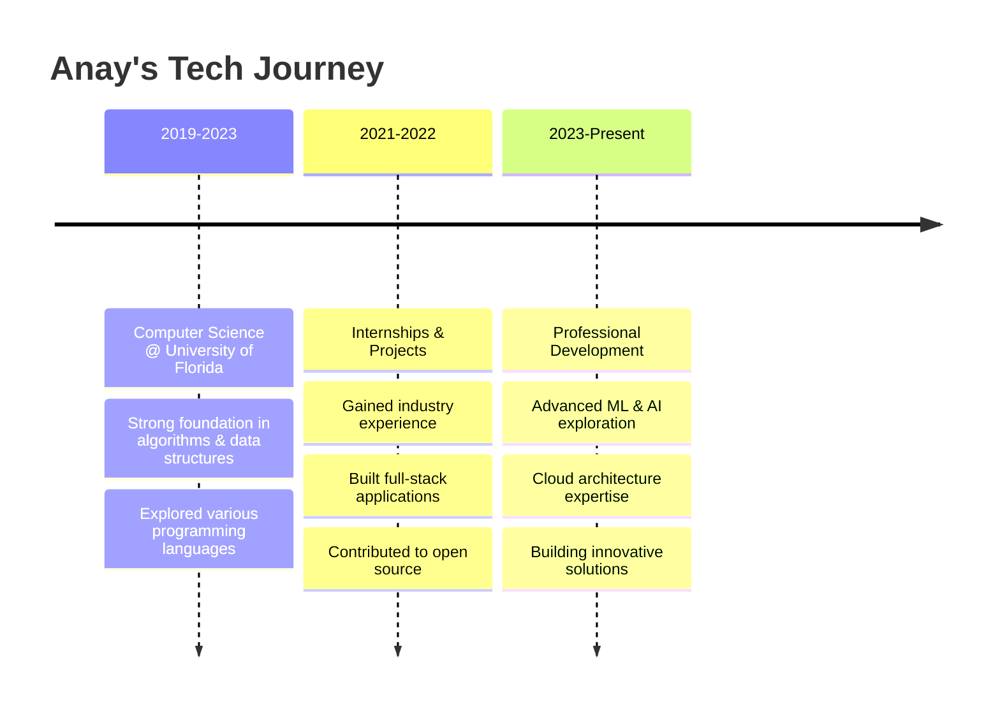

  

  

  
  
  
  
  
  

---

## 🚀 About Me

🎓 **Computer Science Graduate** from the University of Florida  
💼 **Full-Stack Engineer** with expertise in modern web technologies  
🤖 **Machine Learning Enthusiast** exploring AI/ML applications  
🌱 Currently diving deep into **Cloud Architecture** and **DevOps**  
⚡ Fun fact: I love turning coffee into code and ideas into reality!

### 🎯 What I'm up to:
- 🔭 Working on innovative full-stack applications
- 🌱 Learning advanced cloud technologies (AWS, GCP)
- 👯 Looking to collaborate on open-source projects
- 💬 Ask me about React, Node.js, Python, or Machine Learning
- 📫 Reach me at: **anaysinhal.edu@gmail.com**

---

## 📊 GitHub Analytics

  
  

  

  

---

## 🛠️ Tech Stack & Tools

### Languages

### Frontend

### Backend

### Databases

### Machine Learning & AI

### DevOps & Cloud

### Design & Tools

---

## 🏆 Featured Projects

### 🚀 [Project Name 1](https://github.com/anayy09/project1)
**Full-Stack Web Application** | React • Node.js • MongoDB  
A comprehensive web application with real-time features and modern UI/UX design.

### 🤖 [AI/ML Project](https://github.com/anayy09/ml-project)
**Machine Learning Application** | Python • TensorFlow • scikit-learn  
Advanced machine learning model for predictive analytics with high accuracy.

### 📱 [Mobile App](https://github.com/anayy09/mobile-app)
**Cross-Platform Mobile App** | Flutter • Dart • Firebase  
Beautiful and responsive mobile application with cloud integration.

---

## 🎯 Areas of Expertise

<table align="center">
<tr>
<td align="center" width="33%">

**🌐 Full-Stack Development**
Building end-to-end web applications with modern frameworks and best practices

</td>
<td align="center" width="33%">

**🤖 Machine Learning**
Developing intelligent systems using TensorFlow, PyTorch, and advanced algorithms

</td>
<td align="center" width="33%">

**☁️ Cloud & DevOps**
Deploying scalable applications using AWS, Docker, and CI/CD pipelines

</td>
</tr>
</table>

---

## 📈 My Journey

---

## 📝 Latest Blog Posts

<!-- BLOG-POST-LIST:START -->
<!-- BLOG-POST-LIST:END -->

*📖 Check out my [blog](https://anay09.hashnode.dev) for more insights on technology and development!*

---

## 🤝 Let's Connect

### 💭 "Code is poetry written for machines to understand and humans to admire"

---

## 🎨 GitHub Contribution Snake

  <picture>
    <source media="(prefers-color-scheme: dark)" srcset="https://raw.githubusercontent.com/platane/snk/output/github-contribution-grid-snake-dark.svg" />
    <source media="(prefers-color-scheme: light)" srcset="https://raw.githubusercontent.com/platane/snk/output/github-contribution-grid-snake.svg" />
    
  </picture>

---

  
  
  
  
  
  
  

