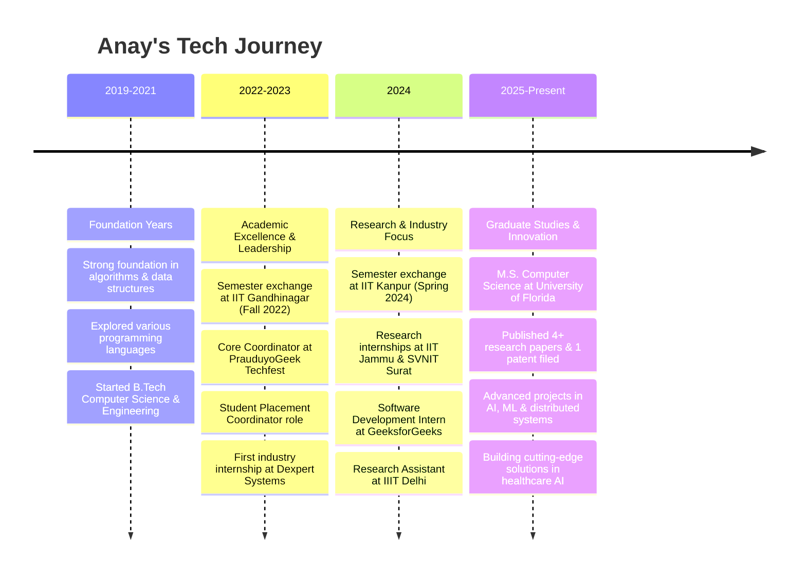

  

  

  
  
  
  
  
  

## 🚀 About Me

🎓 **M.S. Computer Science Student** at the University of Florida  
💼 **AI/ML Researcher** specializing in healthcare diagnostics and medical imaging  
🤖 **Full-Stack Engineer** with proven industry experience at GeeksforGeeks  
🌱 **Published Researcher** with 4+ papers and 1 patent in AI-driven healthcare  

### 🎯 What I'm up to:
- Conducting research in AI-driven healthcare diagnostics
- Exploring quantum computing applications in biomedical research
- Building scalable AI applications with Next.js, PyTorch, and cloud technologies

##

<table>
<tr>
<td align="center" width="50%">

</td>
<td align="center" width="50%">

</td>
</tr>
</table>

## 🛠️ Tech Stack & Tools

<table>
<tr>
<td align="center" width="50%">

**💻 Languages**  

**🎨 Frontend**  

**⚙️ Backend**  

</td>
<td align="center" width="50%">

**🗄️ Databases**  

**🤖 AI/ML**  

**☁️ DevOps & Cloud**  

**🛠️ Tools**  

</td>
</tr>
</table>

## 🎯 Areas of Expertise

<table align="center">
<tr>
<td align="center" width="33%">

**💼 AI-Driven Healthcare**
Developing intelligent diagnostic systems, medical image enhancement, and mental health analytics using deep learning

</td>
<td align="center" width="33%">

**🔬 Research & Development**
Publishing cutting-edge research in ML/AI, with expertise in contrastive learning and multimodal systems

</td>
<td align="center" width="33%">

**🌐 Full-Stack Engineering**
Building scalable applications with modern frameworks, cloud deployment, and high-performance architectures

</td>
</tr>
</table>

## 📈 My Journey

*📖 Check out my [blog](https://anay09.hashnode.dev) for more insights on technology and development!*

  <picture>
    <source media="(prefers-color-scheme: dark)" srcset="https://raw.githubusercontent.com/platane/snk/output/github-contribution-grid-snake-dark.svg" />
    <source media="(prefers-color-scheme: light)" srcset="https://raw.githubusercontent.com/platane/snk/output/github-contribution-grid-snake.svg" />
    
  </picture>

  
  
  
  
  
  
  

